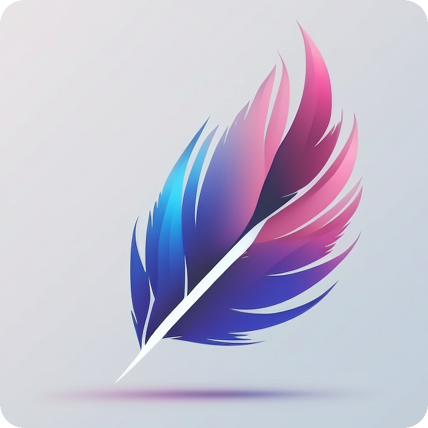

#  elemental Draw


[](https://github.com/Haeri/elementalDraw/blob/master/LICENSE)

Portable C++ canvas library with a Vulkan (Windows, Linux) and OpenGL (MacOS) backend.


## Build Requirements
- [CMake 3.16^](https://cmake.org/download/) 

## Setup

###  Windows

```cmd
git clone https://github.com/Haeri/elementalDraw.git  --recursive
cd elementalDraw
./scripts/generate_project_win.bat
```
###  Linux

```bash
git clone https://github.com/Haeri/elementalDraw.git  --recursive
cd elementalDraw
sudo apt update
sudo apt install -y libxinerama-dev libxcursor-dev xorg-dev libglu1-mesa-dev cmake curl unzip tar nasm
./scripts/generate_project_linux.sh
```

###  macOS

```bash
git clone https://github.com/Haeri/elementalDraw.git  --recursive
cd elementalDraw
brew install nasm
./scripts/generate_project_mac.sh
```

## Feature extensions

elemental Draw supports additional features that can be enabled when generating the project file by adding additional flags to the command: `./scripts/generate_project_win.bat -ui -audio`

- *static* - Generates static libraries so no dynamic linking will be requried.
- *ui* - Provides additional functionality for creating ui elements, layouts and styling. 
- *audio* - Provides additional functionality for reading and playing back audio files.
- *video* - Provides additional functionality for reading and decoding video files. (slow build time)

## Dependencies
Dependencies will be automatically managed through vcpkg if this repo is cloned with the `--recursive` flag.
- [glfw3](https://www.glfw.org/)
- [glslang](https://github.com/KhronosGroup/glslang)
- [stb](https://github.com/nothings/stb)
- [freetype](https://www.freetype.org)
- [ffmpeg](https://www.ffmpeg.org)


## Simple API
Simple API across all platforms.


```cpp
int main(void)
{  
    // create window and context
    elemd::Window* win = elemd::Window::create({"Hello World", 310, 240});
    elemd::Context* ctx = win->create_context();

    // load image
    elemd::Image* logo = elemd::Image::create("./res/logo.png");

    ctx->set_clear_color(elemd::color("#e5e9f0"));

    // main loop
    while (win->is_running())
    {
        win->poll_events();

        // draw text
        ctx->set_fill_color(elemd::color("#2e3441"));
        ctx->set_font_size(30);
        ctx->draw_text(55, 60, "elemental UI");        
        
        // draw circle
        ctx->set_fill_color(elemd::color("#c16069"));
        ctx->fill_circle(80, 135, 15);

        // draw rounded rectangle outline
        ctx->set_line_width(2);
        ctx->set_stroke_color(elemd::color("#80a0c2"));
        ctx->stroke_rounded_rect(130, 120, 30, 30, 5);

        // draw rounded image
        ctx->draw_rounded_image(200, 120, 30, 30, logo, 5);

        ctx->draw_frame();
        ctx->present_frame();
    }
    
    return 0;
}
```